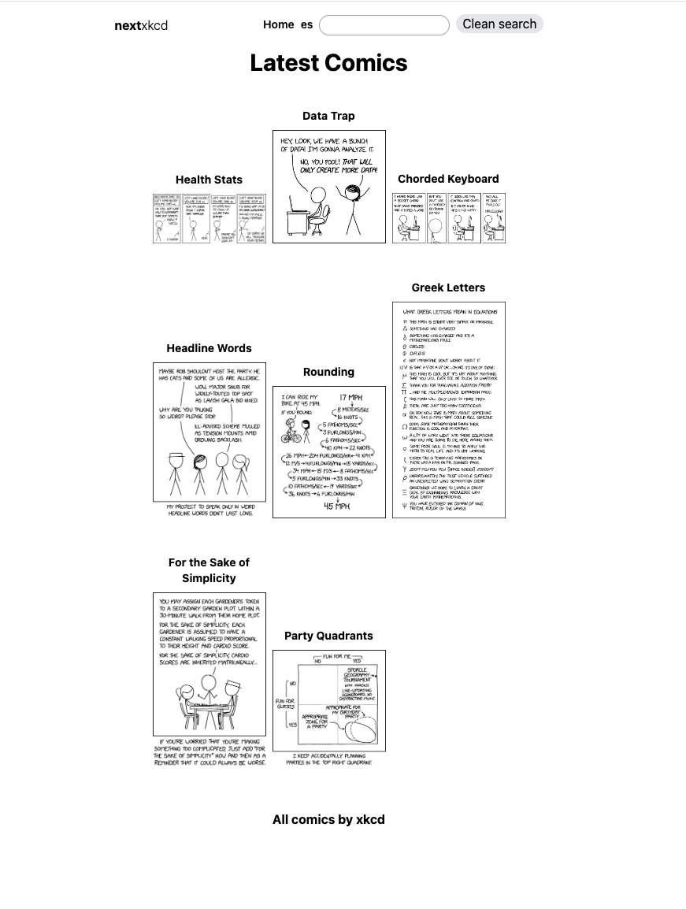
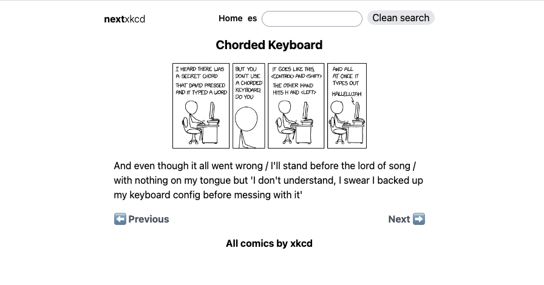

## XKCD-APP Next.js

Aplicacion desarrollada con Next js e implementacion de I18n service (translation), que consume la API https://xkcd.com/json.html

Esta aplicación es el resultado del excelente curso https://www.youtube.com/watch?v=pFT8wD2uRSE&t=19502s de Midudev

Aplicación deployada en: https://xkcd-app-fuhrn.vercel.app/es para versión en español y en https://xkcd-app-fuhrn.vercel.app/en para versión en inglés.

[label](img/home_es.png%0D) [label](node_modules)